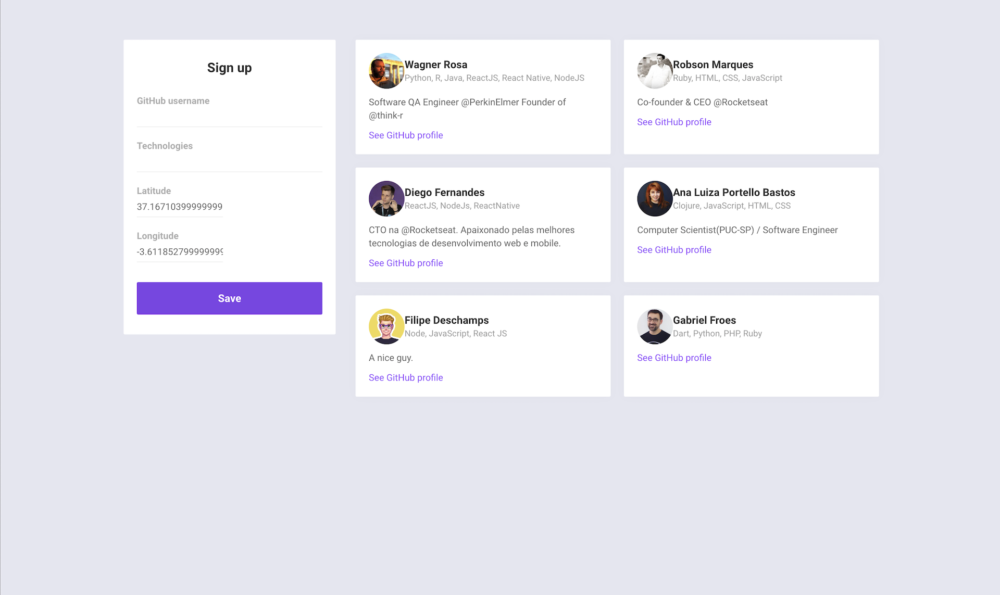
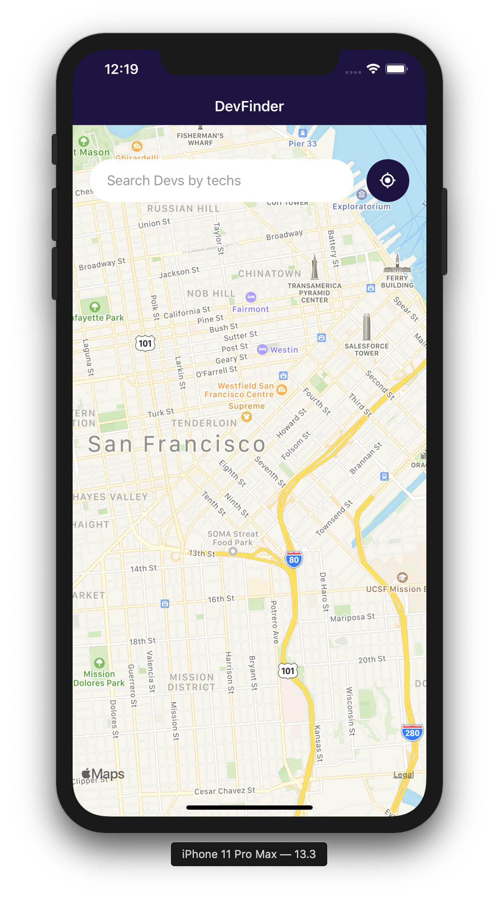

# DevFinder - find devs around your area
# Semana OmniStack 10.0 Rocketseat :rocket:

## :rocket: Tecnologies in this project
- [Node.js](https://nodejs.org/en/)
- [React](https://reactjs.org)
- [React Native](https://facebook.github.io/react-native/)
- [Expo](https://expo.io/)

## :computer: The Projet

DevFinder is a project to connect Devs in a 10 km range.
This project was bootstrapped with [Create React App](https://github.com/facebook/create-react-app).

Web version:

Mobile version:

## Available Scripts

In the project directory, you can run:

### `yarn start`

Runs the app in the development mode. 
Open [http://localhost:3000](http://localhost:3000) to view it in the browser.

The page will reload if you make edits. 
You will also see any lint errors in the console.

### Deployment

This section has moved here: https://facebook.github.io/create-react-app/docs/deployment

## :mortar_board: The mastermind

This project was done following the Grand Master [Diego Fernandes](https://github.com/diego3g)

## :memo: Licence

MIT [LICENSE](LICENSE.md).
